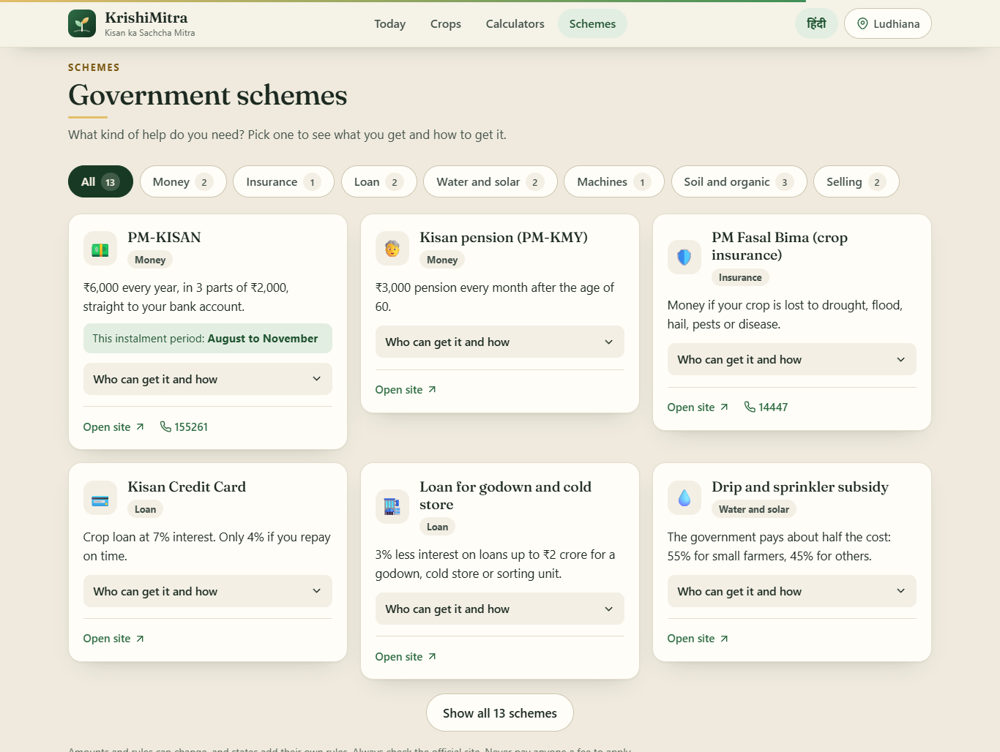
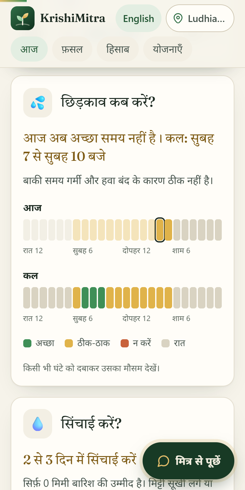
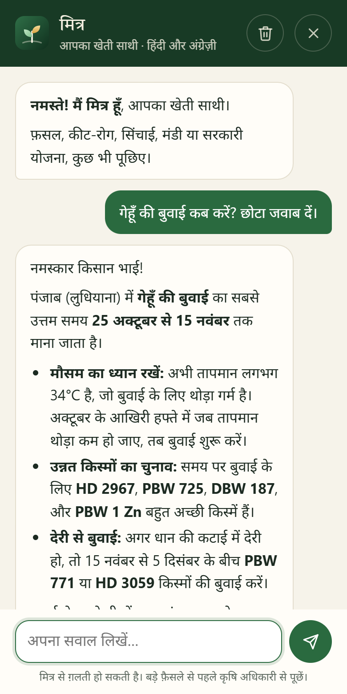
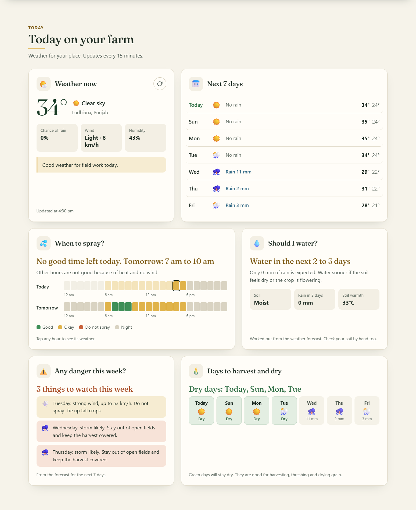
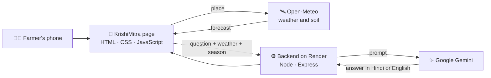

<div align="center">


### 🌾 अपनी ज़मीन, अपनी जानकारी 🌾

**The farm helper that speaks the farmer's language.**


<br/>

[](https://krishi-mitra-silk-nine.vercel.app)
&nbsp;
[](https://deepak17kb.github.io/KrishiMitra/)

<br/>


</div>

<br/>

<p align="center">
  
</p>

---

## 🌱 The idea

A farmer does not need a dashboard. A farmer needs answers.

> *Should I spray today? Should I water? What do I sow this month? What price will I get?*

KrishiMitra turns live weather and soil data into those plain answers, on one calm page, in Hindi or English. And when the page is not enough, there is **Mitra**, an AI helper that already knows the farmer's place, weather and season.

No login. No app to install. No cost.

---

## 🚜 What a farmer gets

<table>
<tr>
<td width="50%" valign="top">

### 🌤️ Today on the farm
- **Weather now**, with one line of advice for field work
- **Next 7 days** of rain and temperature
- **When to spray?** Every hour of today and tomorrow marked good, okay or do not spray
- **Should I water?** A straight yes, wait or no hurry
- **Any danger this week?** Storm, heavy rain, heat, frost and strong wind warnings
- **Days to harvest and dry**: the dry days of the week at a glance

</td>
<td width="50%" valign="top">

### 🌾 This season
- **What to sow?** Kharif, Rabi and Zaid crops, with "sow now" tags for the current month
- **My crop calendar**: enter the sowing date and get the dates for watering, urea and harvest
- **Watch out for** the pests and diseases of the season: the sign to look for and the first thing to do
- **Government price (MSP)** for Kharif 2026-27 and Rabi 2027-28

</td>
</tr>
<tr>
<td width="50%" valign="top">

### 🧮 Easy calculators
- **How much fertilizer?** Answer in bags of urea, DAP and potash
- **How much seed?** For 13 common crops
- **How much profit?** With the price below which you make a loss
- **Crop insurance cost** under PM Fasal Bima
- **Crop loan interest** on a Kisan Credit Card, on time and late
- **Land units**: acre, hectare, guntha, kanal, marla, cent

</td>
<td width="50%" valign="top">

### 🏛️ Government schemes
- **13 schemes** with what you get, who can get it and how to apply
- **Pick the help you need**: money, insurance, loan, water and solar, machines, soil and organic, selling
- **Papers you need**: a checklist the phone remembers
- **Helplines**: tap a number and the phone calls it
- **Government apps**: Meghdoot, PM-KISAN, Crop Insurance, e-NAM

</td>
</tr>
</table>

<p align="center">
  
</p>

And on every page: **Mitra**, the AI helper. Ask anything, in Hindi, Hinglish or English.

---

## 📱 Made for the phone in a farmer's hand

<p align="center">
  
  &nbsp;&nbsp;
  
  &nbsp;&nbsp;
  
</p>

<p align="center"><sub>Home in Hindi &nbsp;·&nbsp; When to spray and when to water &nbsp;·&nbsp; Mitra answering a question</sub></p>

- 🗣️ **One tap switches the whole page to Hindi**, including dates, units and crop names
- 👆 **Big buttons, large text** and simple words. No farming jargon, no English-only terms
- 🍏 **Works on iPhone and Android**. Can be added to the home screen like an app
- 🐢 **Light on slow networks**: three small files, one font, no frameworks
- 🎬 **Calm motion**: soft entrances and hover effects, switched off for people who prefer no animation

---

## 🛰️ Real data only

Nothing on the page is made up or simulated.

| What you see | Where it comes from |
|---|---|
| Weather, 7 days, hourly wind and rain | [Open-Meteo](https://open-meteo.com) forecast for the farmer's own location |
| Soil moisture and soil temperature | Open-Meteo soil model |
| Spray timing | Worked out hour by hour from wind, rain, heat and humidity |
| Watering advice | Water the crop will lose in 3 days, compared with the rain that is coming |
| Weekly warnings and dry days | The 7-day forecast, checked for storms, heavy rain, heat, frost and strong wind |
| Schemes | Checked against the official scheme websites in October 2026 |
| MSP | As announced by the Union Cabinet (Kharif: 13 May 2026, Rabi: 1 October 2026) |
| Mitra's answers | Google Gemini, guided by an agriculture prompt plus the live weather and season |

<p align="center">
  
</p>

---

## 🧭 How it works



The backend tries several Gemini models in turn. If one is busy, the next one answers, so the farmer is not left with an error.

---

## 🧰 Tech stack

| Part | Built with | Why |
|:--|:--|:--|
| 🌐 Website | HTML, CSS, vanilla JavaScript | No build step. Three files that open anywhere. |
| ⚙️ Backend | Node.js and Express | A small chat API with CORS, rate limiting and error handling |
| ✨ AI | Google Gemini | Free tier, with automatic fallback between models |
| 🌦️ Weather and soil | Open-Meteo | Free, no API key |
| 📍 Place search | Open-Meteo Geocoding and BigDataCloud | Free, no API key |

---

## 🗂️ What is in the box

```
KrishiMitra/
│
├── index.html               ← the page (English text, Hindi in data-hi)
├── style.css                ← the look, motion and phone layout
├── script.js                ← weather, widgets, calculators, chat, language
├── favicon.svg              ← the sprout logo
├── manifest.webmanifest     ← lets phones add the site to the home screen
├── docs/                    ← screenshots for this README
│
└── backend/
    ├── server.js            ← chat API that talks to Gemini
    ├── package.json
    ├── .env.example
    └── .env                 ← your key lives here. Never commit it.
```

---

## 🌿 Run it on your computer

**1. Get the code**
```bash
git clone https://github.com/Deepak17kb/KrishiMitra.git
cd KrishiMitra/backend
```

**2. Install and add your key**
```bash
npm install
cp .env.example .env
```

Open `.env` and paste a free Gemini key from [aistudio.google.com](https://aistudio.google.com):
```env
GEMINI_API_KEY=your_gemini_api_key_here
PORT=3000
NODE_ENV=development
```

**3. Start the backend**
```bash
npm start
```

**4. Open the site**

Serve the project folder on port 5500 (the *Live Server* extension in VS Code does this) and open:

```
http://localhost:5500/?backend=local
```

`?backend=local` tells the page to use the backend on your computer. Without it, the page talks to the live backend on Render.

---

## 🚀 Where it lives

| Part | Host | How it updates |
|---|---|---|
| Website | [Vercel](https://krishi-mitra-silk-nine.vercel.app) and [GitHub Pages](https://deepak17kb.github.io/KrishiMitra/) | By itself, on every push to `main` |
| Backend | [Render](https://krishimitra-backend-6spu.onrender.com/health), running the `backend` folder | By itself, on every push to `main` |

The backend needs one secret on Render: `GEMINI_API_KEY`.

If the website ever moves to a new address, add that address to the `cors` list in `backend/server.js`, or the chat will be blocked.

---

## 🗓️ Once a year

Three lists in `script.js` need a fresh look each year:

- **`MSP`**: the government prices. Kharif prices come out around June, Rabi prices around October.
- **`SCHEMES`**: amounts and rules of the government schemes.
- **`PROFIT_CROPS`**: the example yield and cost in the profit calculator.

The Gemini models are listed in `GEMINI_MODELS` at the top of `backend/server.js`.

---

> 🔒 **Before you push:** check that `.env` is in `.gitignore`. Keys left in public repositories are found and misused within minutes.

---

<div align="center">

### 🙏 जय जवान, जय किसान

*Made with care for the people who feed the country.*

<br/>


</div>
